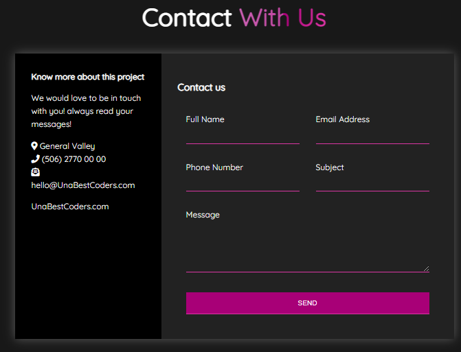

# RWDGridForm
Simple Responsive web design using grid css

## Mobile First design
When designing websites, always it is easier to begin with a mobile version, but everything has an exception rule.

## Adjust for large pages
With CSS, we can change every detail and display the website in a completely different way on mobile.
